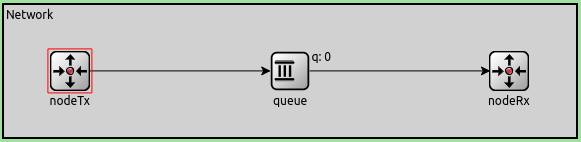
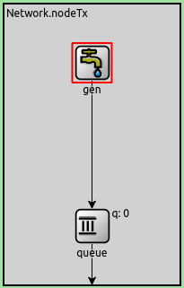
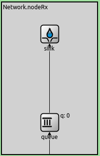

# Redes y Sistemas Distribuidos 2024 - Informe de Laboratorio
## *Laboratorio 3: Capa de Transporte, Control de flujo y Control de congestion* 

***
## Grupo n°42

### Integrantes:
  * Viera, Alfredo
  * Oliva, Luca
  * Ramirez, Ignacio

> En este proyecto presentamos un modelo de colas que consta de un generador, una cola y un sumidero conectados en una red Network. Se ha configura una simulación de 200s donde el generador va a crear y transmitir paquetes de tamaño arbitrario, con intervalos dados por una distribución de media configurable, y donde la cola es capaz de atenderlos bajo una misma distribución.

## *Índice*

* Introducción

* Métodos  

* Resultados

* Discusión

* Referencias

## *Resumen*

En este trabajo se analizará el desempeño de una Network frente a dos casos de estudio que modelan problemas habituales en el diseño de algoritmos para control de flujo y control de congestión, basándonos en el concepto de cuellos de botella dados por redes con tasa de transmición alta o receptores de baja capacidad, utilizando simulaciones paramétricas. Se diseñará un algoritmo con la meta de solucionar los problemas identificados y mejorar el rendimiento de nuestra Network.

## *Introducción*

A continuación se describira la red analizada en este proyecto, demostrando el comportamiento de la Network y los distintos problemas de flujo y congestión que surgen en ella, según dos casos que estudiaremos donde se varía la velocidad de transmisión de datos y la demora en diferentes partes de esta red.

En la *figura Network* podemos observar que la red en cuestión consta de tres componentes bien defindos: Un nodo transmisor (NodeTx) que genera y transmite los paquetes simulando un host emisor enviando paquetes recibidos por la capa de aplicación. Un buffer que recibe los paquetes emitidos por el generador, encolandolos y emitiendolos con cierta demora, creando un espacio de tiempo de manera que el receptor de estos paquetes pueda procesar los paquetes. Finalmente tenemos un nodo receptor (NodeRx) que es el destino final de los paquetes, el cual simula el host receptor de estos paquetes que viajan por la red y es quien se encargará de procesarlos.

En la *figura nodeTx* podemos ver las componentes del nodo transmisor, tenemos un generador que crea y emite los paquetes, y un buffer que encola los paquetes emitidos antes de transmitirlos fuera del nodo de manera controlada.

En la *figura nodeRx* se observan las componentes del nodo receptor. Este se compone por un buffer en el cual se alojan los paquetes recibidos, para luego enviarlos al sink, que es el destino final de los paquetes enviados.

## Casos de estudio

Para los siguientes casos de estudio, mantuvimos las siguientes constantes:

* Tamaño del buffer del nodeTx: 2.000.000.
* Tamaño del buffer entre el nodeTx y el nodeRx: 200.
* Tamaño del buffer del nodeRx: 200.
* Tamaño en bytes de paquete: 12500.

### Caso De Estudio 1

* Para el primer caso de estudio se tuvo la siguiente configuración:

~~~
    - NodeTx a Queue: datarate = 1 Mbps y delay = 100 us
    - Queue a NodeRx: datarate = 1 Mbps y delay = 100 us
    - Queue a Sink: datarate = 0.5 Mbps
~~~

Estudiaremos como se comporta la red con un intervalo de generación de paquetes que tenga una distribución exponencial de 0.1, 0.165, 0.25 y 0.5 segundos.

Haciendo un análsis pre-ejecución, podemos observar que la configuración del *datarate* del buffer de `nodeRx` a `sink` tiene una magnitud del 50% a comparación del resto de los bufferes, por lo que podemos estimar que a medida que el intervalo de generación del paquete se hace mas pequeño se producirá una congestión en este tramo.

Realizando ejecuciones del proyecto con los 4 intérvalos de generación de paquetes, obtuvimos los siguientes gráficos:

|Carga Ofrecida vs. Carga Util|
|:---------------------:|
||

En este gráfico podemos visualizar el hecho que a medidad que la cantidad de paquetes que enviamos aumenta, llega un punto en el cual los bufferes receptores no pueden dar servicio a los paquetes a la velocidad en que se transmiten, ocurriendo los fenomenos de congestión y pérdida de paquetes.

***
***

|Generation interval 0.1|Generation interval 0.165|Generation interval 0.5|Generation interval 1|
|:---------------------:|:---------------------:|:---------------------:|:---------------------:|
|||||

*Uso de buferes vs tiempo de ejecución*

Se puede observar en estos cuatro gráficos, como a medida que el intérvalo de generación de paquetes se hace más chico, incrementa la cantidad de paquetes encolados en los bufferes considerablemente, al punto de llegar a su capacidad máxima, pasando el incremento de uso a ser constante, y comenzar con la pérdida de paquetes, al no poder manejar la velocidad de transmición del emisor. Analizando cada gráfico:

* En el *gráfico 1.1.1* con un intervalo de *0.1* ocurre una congestión en el buffer de `nodeRx` dado que recibe paquetes más rápido de lo que lo puede transmitir, esto se ve en el gráfico donde la cantidad de paquetes en el buffer incrementa hasta llegar a la capacidad máxima del buffer de 200 paquetes, luego de eso pasa a ser constante.
  
* En el *gráfico 1.2.1* con un intervalo de *0.165* también se genera una congestión de manera similar al de la red con intervalo de generacion 0.1, sólo que de manera mas paulatina, razón por la cual, el buffer se llena en el segundo final del tiempo de ejecución, registrando solo 1 paquete perdido.

* En el *gráfico 1.3.1* con el intervalo en *0.5* vemos que hay suficiente tiempo entre la emisión de paquetes por lo que le da al `nodeRx` tiempo suficiente para procesar los paquetes, evitando la pérdida de paquetes. También podemos ver que la cantidad de paquetes en el buffer la mayor parte del tiempo se mantiene en 1, pero en ciertos momentos donde el intervalo de generación se vuelve mas pequeño, el buffer del medio tiene que encolar, esto se debe a que el intervalo es una distribución y no una constante.

* En el *gráfico 1.4.1* con un intervalo de *1.0* podemos identificar que la cantidad de paquetes en el buffer oscila entre 0 y 1 respectivamente, esto se debe a que espacio de tiempo entre cada emisión de paquetes es tan grande que al `nodeRx` le da tiempo suficiente para procesar un paquete antes de que llegue otro.

Como una apreciación general, se puede observar que a medida que disminuye el orden de magnitud de cantidad de paquetes enviados, el uso de los bufferes en la red disminuye, y excluyendo al nodo receptor, el resto de los bufferes del network han tenido un nivel de utilizacion baja comparativamente, dado el mayor caudal de transmisión.

***
***

|Generation interval 0.1|Generation interval 0.165|Generation interval 0.5|Generation interval 1|
|:---------------------:|:---------------------:|:---------------------:|:---------------------:|
|||||

*Delay de atención vs tiempo de ejecución*

Observemos ahora el delay de atención de un paquete en relación al tiempo de ejecución. Debido a que el datarate entre el buffer y el sink es menor que en el resto de la red podemos observar que la congestión ocurre dentro de `nodeRx`. 

* Con un intervalo de 0.1 vemos como a medida que se va saturando el buffer, el delay en la atención de paquetes comienza a elevarse, hasta el punto donde se llena el buffer y el delay se estabiliza en un promedio de 40 segundos. A medida que incrementa el intervalo de generacion de paquetes, disminuye el delay y la cantidad de paquetes presentes en el buffer.

***

### Caso de estudio 2

* Para el segundo caso de estudio se tuvo la siguiente configuración:

~~~
  - NodeTx a Queue: datarate = 1 Mbps y delay = 100 us
  - Queue a NodeRx: datarate = 0.5 Mbps
  - Queue a Sink: datarate = 1 Mbps y delay = 100 us
~~~

 Como podemos observar, el caso de estudio 2 es similar al caso 1, con la diferencia de que esta vez el datarate del Queue al `NodeRx` se reduce a 0.5 Mbps, y el datarate del queue de `NodeRx` al sink es de 1 Mbps, por lo que podemos esperar ver resultados similares pero con el fenómeno de congestión en el queue del network, en lugar el queue interno a `NodeRx`.

Veamos los resultados de la simulación:

|Generation interval 0.1|Generation interval 0.165|Generation interval 0.5|Generation interval 1|
|:---------------------:|:---------------------:|:---------------------:|:---------------------:|
|||||

*Uso de buferes vs tiempo de ejecución*

|Generation interval 0.1|Generation interval 0.165|Generation interval 0.5|Generation interval 1|
|:---------------------:|:---------------------:|:---------------------:|:---------------------:|
|||||

*Delay de atención vs tiempo de ejecución*

Se puede visualizar de inmediato que los gráficos presentados son similares a los que se encuentran en el caso 1, con la excepción de que el buffer afectado ahora es el queue central entre `nodeTx` y `nodeRx`. Vemos en los gráficos que a medida que disminuye el intervalo de generación de paquetes, se va saturando la queue, lo que, como consecuencia produce más delay en la red.

***

Haciendo un análisis entre los dos casos de estudio vemos que la única diferencia en los resultados es cuando se ven con detenimiento las zonas afectadas, en el primer caso vemos que el buffer del nodo receptor es el que se afecta a medida que disminuye el intervalo de generación de paquetes y en el segundo caso es el buffer que se encuentra en el medio de la red, entre el nodo transmisor y el receptor.

## *Métodos*

***
Para solucionar los problemas existentes en la red se plantea un algoritmo de control de flujo y control de congestión. Primero se agregó un canal de retorno a través del cual el `nodoRx` puede mandar paquetes de control al `nodoTx`. Además se plantean modificar los modulos `queue` internos por nuevos módulos `transportRx` y `transportTx` respectivamente para poder indicar comportamientos diferentes a cada uno.

La nueva estructura de la red queda entonces:

*Figura 3.1: La red con canal de retorno*

*Figura 3.2: El nuevo nodeTx con el modulo TransortTx#*

*Figura 3.3: El nuevo nodeRx con el modulo TransportRx*

Luego de aplicar dichas modificaciones podemos empezar a describir un algoritmo propio. El algoritmo se encargará de manejar un nuevo delay que se agrega en la salida del módulo `transportTx` aplicando entonces control de flujo y de congestión.

### Mensajes de Control

A través del canal de retorno, el módulo `nodeRx` podrá enviar mensajes de control al módulo `nodeTx`. Estos mensajes serán de similares características que los mensajes de datos, pero tendrán el mínimo tamaño y utilizamos el campo `kind` para diferenciarlos. Los mensajes quedan divididos de la siguiente manera:

* *Mensajes de tipo 2*: Mensajes de control que indican al nodeTx que aumente el delay entre cada paquete.
* *Mensajes de tipo 3*: Mensajes de control que indican al nodeTx que disminuya el delay entre cada paquete.
* *Mensajes de otro kind*: Mensajes de datos.

El módulo `transportTx` tendrá el siguiente comportamiento al recibir mensajes de control:

* *Kind 2*: Aumenta el delay entre cada paquete en 0.1 segundos
* *Kind 3*: Disminuye el delay entre cada paquete en 0.2 segundos

La diferencia entre el intervalo de aumento y disminución le permite al módulo `transportTx` recuperarse rápidamente cuando los problemas de flujo o congestión disminuyen.

### Envío de los Mensajes de Control

El comportamiento mas interesante del algoritmo es el que describe como el módulo `transportRx` detecta problemas y envía los mensajes de control. Podemos divir el comportamiento en dos grandes grupos: Control de Flujo y Control de Congestión.

### Control de Flujo

El control de flujo es necesario cuando se encuentra en la red un nodo receptor de baja capacidad que no es capaz de procesar los paquetes entrantes a tiempo. Cuando esto ocurre, se empiezan a acumular paquetes en el `queue` del modulo receptor (`transportTx` en nuestro caso) y este puede llegar a perder paquetes si el problema no se controla a tiempo. Este problema es fácil de detectar, ya que el módulo `transportRx` tiene acceso al estado actual de su `queue` interno. El módulo debe enviar entonces un mensaje de tipo 2 por el canal de retorno cuando le llega un paquete nuevo y detecta que la capacidad de su cola supera cierto umbral (Una configuración del 80% parece funcionar bien). Al mismo tiempo, si al llegar un paquete la capacidad de su cola no supera el umbral, envía un mensaje de tipo 3.

### Control de Congestión

El control de congestión es necesario cuando hay un nodo intermedio en la red que se encuentra desbordado (Le llegan paquetes más rápido de lo que puede procesar) y comienza a perder paquetes. Este problema es más complicado de tratar, ya que el módulo `transportRx` no tiene acceso al estado de los nodos intermedios. Para detectar congestión se usará una nueva métrica de **delay**. Esta metrica medirá ,de cada paquete ,cuanto tiempo transcurre desde que sale de `transportTx` hasta que llega a `transportRx` (El tiempo que anda recorriendo la red).
Cuando llega el primer paquete al modulo `transportRx` se registra el delay del mismo y éste se toma como referencia para el resto de la comunicación. En el resto de los paquetes se mide el delay y se compara con esa referencia. Si el delay de un mensaje entrante es mayor a la referencia multiplicada por una tolerancia (Esta tolerancia es otro parámetro que se puede modificar, pero un valor de 5 parace ser un buen balance) se envia un mensaje de tipo 2. En caso contrario se envia un mensaje de tipo 3.

### Módulo impaciente

El último control que se aplica sobre el modulo `transportRx` se lo denomina "Modulo Impaciente". El mismo consiste en un timer interno dentro de `transportRx` que envia un mensaje de tipo 3 cuando pasa cierto tiempo sin recibir paquetes. Este timer ayuda al modulo `transportTx` a recuperar la velocidad de trasnmision mas rapidamente en caso que el mismo haya disminuido mucho.

***

## *Resultados*

|||||
|:---------------------:|:---------------------:|:---------------------:|:------------------:|

Luego de correr las simulaciones parametricas en el caso 1 pero con el algoritmo implementado notamos XXXXX diferencias principales:

* La capacidad del buffer del móduloRx oscila entre el 80% y 70% de capacidad en lugar de llegar al 100%. Esto permite que no se pierdan paquetes.
* Como consecuencia, los paquetes que antes se perdían se encuentran en el queue del módulo Tx.
* La vida del paquete dentro del buffer esta directamente relacionada a la cantidad de paquetes en el buffer.
* El delay de la red aumenta de manera lineal sin aparente límite, ya que el generador esta emitiendo paquetes más rapidamente de lo que la red puede soportar. Los paquetes quedan encolados en el módulo `transportTx` hasta que pueden salir.

|||||
|:---------------------:|:---------------------:|:---------------------:|:------------------:|

Podemos ver en los graficos que el nodeRx trata de mantener el delay en cierto umbral comunicandose con el transmisor para indicarle si debe incrementar o disminuir la velocidad de transmision, con esto vemos como oscila la cantidad y duracion de los paquetes en el Queue en cierto rango tratando de estabilizarse. Podemos ver en la ultima grafica como no se pierden paquetes y la cantidad de paquetes no sobrepasa 7.5% (15 paquetes) de la capacidad del queue.

||||
|:-:|:-:|:-:|

Podemos ver en estos gráficos de carga emitida que nuestro algoritmo logra saturar la red por completo en los casos 1 y 2 al igual que en la parte 1 (Por eso todas las lineas se encuentran superpuestas). La diferencia principal es que el algoritmo no pierde paquetes y esto lo logra comprometiendo un poco el delay de los mismos.

***

## *Discusión*

Luego de implementar y analizar el algoritmo se identificaron ciertos aspectos para mejorar en una futura versión.

1. Hay multiples parámetros que controlan como funciona el algoritmo (El umbral para control de flujo, la tolarancia para control de congestión o el timer del "Modulo Impaciente" por ejemplo). Durante la implementación se seleccionaron valores que dan un buen resultado, pero no se realizó un analisis exhaustivo para encontrar el punto óptimo de cada uno.
2. También es probable que el mejor valor para los parametros mencionados anteriormente no sea un valor fijo sino que el algoritmo se beneficie de algún tipo de ajuste dinamico para acomodarse mejor las condiciones especificas de cada red.
3. En la seccion de Control de Congestión se utiliza el delay del primer paquete que llega como métrica para comparar el resto de paquetes. Una mejor estrategia contemplaría una modificación de esa metrica a lo largo de la vida de la red, utilizando un delay promedio o actualizandolo cada cierto tiempo.
4. Un aspecto que se podría mejorar es la cantidad de mensajes de control que se envían. En redes de baja capacidad (En donde el algoritmo es más necesario) puede afectar la alta cantidad de paquetes de control que se envían y contribuir a los problemas de congestión ya presentes. Una mejor solución podría mandar menos paquetes e incluir mas información sobre cuanto aumentar o disminuir el delay de transmisión.

## *Referencias*

* ANDREW S. TANENBAUM y DAVID J. WETHERALL, Redes de computadoras (5ta Edición), PEARSON EDUCACIÓN, México, 2012.
* Manual de uso OMNeT++: https://doc.omnetpp.org/omnetpp/manual.
* 
